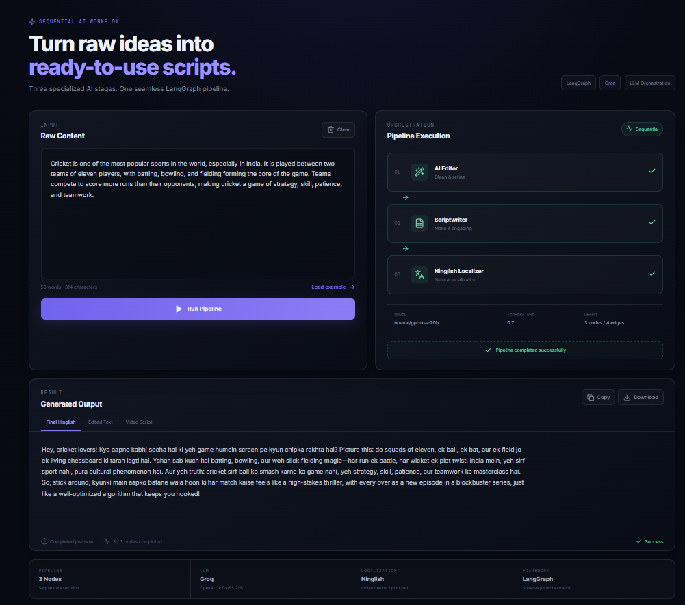
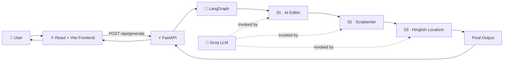
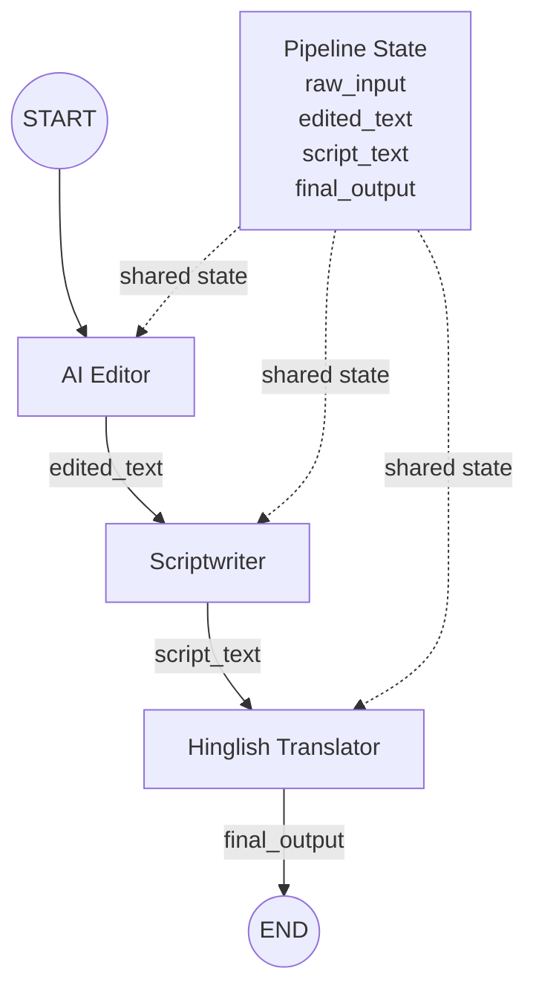
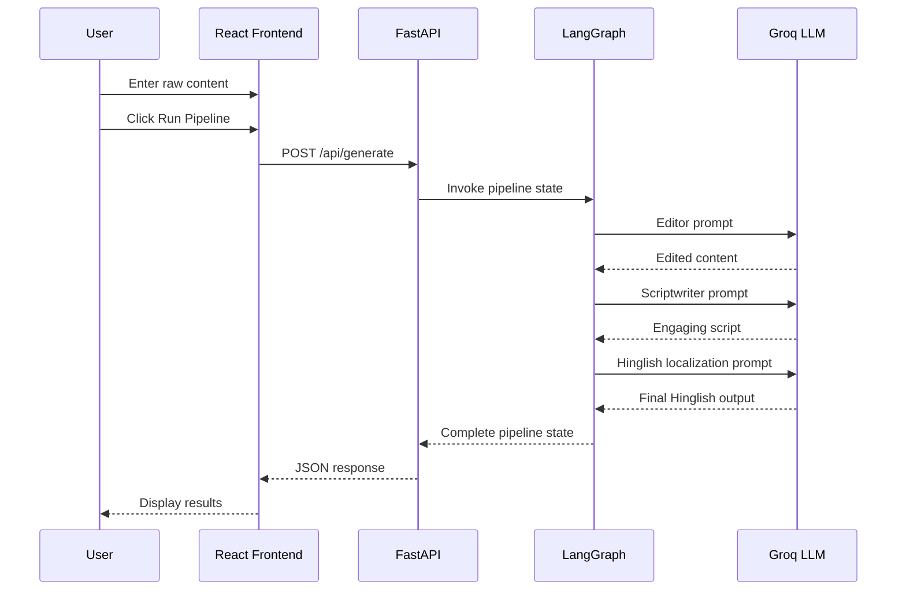
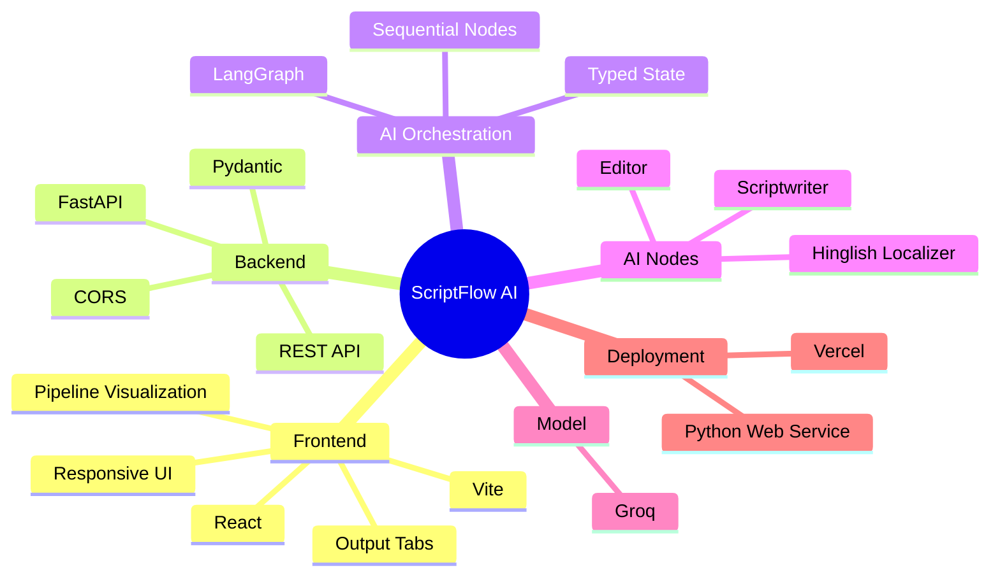

# ScriptFlow AI — LangGraph Content Pipeline

<div align="center">

# ⚡ ScriptFlow AI

### A production-style AI content transformation pipeline powered by **LangGraph + FastAPI + Groq + React**

Turn raw ideas into polished, engaging, naturally localized Hinglish content through a sequential multi-stage AI workflow.

[](https://langgraph-ai-content-pipeline.vercel.app/)
[](https://github.com/rajputshivamsingh510/langgraph-ai-content-pipeline)
[](https://www.langchain.com/langgraph)
[](https://fastapi.tiangolo.com/)
[](https://react.dev/)

</div>

---

## 🖥️ Frontend Preview



> **Try it live:** [langgraph-ai-content-pipeline.vercel.app](https://langgraph-ai-content-pipeline.vercel.app/)

---

## 🎯 Project Objective

ScriptFlow AI demonstrates how a **stateful, sequential LangGraph workflow** can be exposed through a web application and used to transform unstructured text into publish-ready content.

Instead of asking one LLM prompt to do everything, the application separates the work into focused AI stages:

1. **AI Editor** — cleans grammar, spelling, clarity, and flow.
2. **Scriptwriter** — turns the edited content into a punchy, conversational video script.
3. **Hinglish Localizer** — adapts the script into natural Indian Hinglish while preserving its meaning and energy.

The result is a practical example of **AI orchestration**, where each node has a dedicated responsibility and the final output is produced from the state generated by the previous nodes.

---

## 🧠 Core Architecture



### LangGraph State Flow



---

## 🌳 Pipeline Tree

```text
ScriptFlow AI
│
├── Input Layer
│   └── Raw Content
│
├── LangGraph Workflow
│   │
│   ├── Node 01 — AI Editor
│   │   └── raw_input → edited_text
│   │
│   ├── Node 02 — Scriptwriter
│   │   └── edited_text → script_text
│   │
│   └── Node 03 — Hinglish Localizer
│       └── script_text → final_output
│
├── API Layer
│   └── FastAPI /api/generate
│
└── Presentation Layer
    └── React + Vite UI
```

---

## 🔄 End-to-End Workflow



---

## ✨ Features

### AI Pipeline

- Sequential multi-agent workflow with LangGraph
- Dedicated node for editing
- Dedicated node for script generation
- Dedicated node for Hinglish localization
- Shared typed pipeline state
- Groq-powered LLM inference

### Frontend

- Modern dark AI/developer dashboard
- Pipeline visualization with three stages
- Raw content editor
- Character and word counter
- Example content loader
- Run pipeline interaction
- Separate output tabs for each stage
- Copy output to clipboard
- Download generated output as `.txt`
- Pipeline status and stage progression
- Responsive interface

### Backend

- FastAPI REST API
- Pydantic request/response validation
- CORS configuration for frontend integration
- Health endpoint
- Swagger/OpenAPI documentation
- Environment-based API key management

---

## 🛠️ Technology Stack

| Layer | Technology | Purpose |
|---|---|---|
| Frontend | React | Interactive UI |
| Frontend | Vite | Development/build tooling |
| Frontend | Lucide React | Interface icons |
| Styling | CSS | Responsive dark UI |
| Backend | FastAPI | REST API |
| Workflow | LangGraph | Stateful AI orchestration |
| LLM | Groq | Fast model inference |
| Validation | Pydantic | API schemas |
| Server | Uvicorn | ASGI application server |
| Deployment | Vercel | Frontend hosting |
| Deployment | Render / similar Python host | Backend hosting |

---

## 📁 Recommended Project Structure

```text
langgraph-ai-content-pipeline/
│
├── backend/
│   ├── api.py                  # FastAPI application + API routes
│   ├── sequential_base.py      # LangGraph workflow
│   ├── requirements.txt        # Python dependencies
│   ├── .env.example            # Environment variable template
│   └── .gitignore              # Backend secrets/cache exclusions
│
├── frontend/
│   ├── src/
│   │   ├── main.jsx           # React application
│   │   └── styles.css          # UI styling
│   ├── index.html
│   ├── package.json
│   └── ...
│
├── README.md
└── .gitignore
```

---

## 🚀 Local Setup

### 1. Clone the repository

```bash
git clone https://github.com/rajputshivamsingh510/langgraph-ai-content-pipeline.git
cd langgraph-ai-content-pipeline
```

### 2. Backend setup

```powershell
cd backend
python -m venv venv
venv\Scripts\Activate.ps1
pip install -r requirements.txt
```

Create a `.env` file:

```env
GROQ_API_KEY=your_groq_api_key
```

Start FastAPI:

```powershell
uvicorn api:app --reload
```

Backend:

```text
http://127.0.0.1:8000
```

Swagger docs:

```text
http://127.0.0.1:8000/docs
```

### 3. Frontend setup

Open a second terminal:

```powershell
cd frontend
npm install
npm run dev
```

Frontend:

```text
http://localhost:5173
```

---

## 🔌 API

### `GET /`

Returns basic service information.

### `GET /health`

Health check endpoint.

### `POST /api/generate`

Runs the complete LangGraph workflow.

#### Request

```json
{
  "raw_input": "India is one of the world's fastest growing technology markets."
}
```

#### Response

```json
{
  "raw_input": "India is one of the world's fastest growing technology markets.",
  "edited_text": "India is one of the world's fastest-growing technology markets.",
  "script_text": "India is not just a technology market anymore...",
  "final_output": "India sirf ek technology market nahi hai..."
}
```

> The exact generated text will vary because the LLM generates the response dynamically.

---

## 🔐 Environment Variables

Never commit secrets to GitHub.

```env
GROQ_API_KEY=your_groq_api_key
```

Recommended `.gitignore` entries:

```gitignore
.env
venv/
node_modules/
dist/
__pycache__/
*.pyc
```

---

## ☁️ Deployment

### Frontend — Vercel

The frontend is deployed at:

**https://langgraph-ai-content-pipeline.vercel.app/**

For a monorepo deployment, set the Vercel project root directory to:

```text
frontend
```

Build command:

```bash
npm run build
```

Output directory:

```text
dist
```

Set the frontend environment variable to the deployed backend:

```env
VITE_API_URL=https://your-backend-url
```

### Backend — FastAPI

Deploy the `backend` directory as a Python web service.

Build command:

```bash
pip install -r requirements.txt
```

Start command:

```bash
uvicorn api:app --host 0.0.0.0 --port $PORT
```

Set:

```env
GROQ_API_KEY=your_groq_api_key
```

Also update FastAPI CORS to include your production Vercel domain.

---

## 🧪 Example Input

Try this in the application:

> India is a diverse country with many languages, cultures, and traditions. At the same time, India is becoming a major technology and innovation hub, with rapid growth in artificial intelligence, startups, digital payments, and space technology.

The pipeline transforms the input through three stages:

```text
Raw Content
     ↓
Clean & Refine
     ↓
Engaging Video Script
     ↓
Natural Hinglish Localization
     ↓
Publish-ready Output
```

---

## 🧩 Why LangGraph?

A single LLM prompt could technically attempt all of these tasks, but separating them into graph nodes makes the workflow easier to reason about and extend.

Each node has a clear responsibility:

| Node | Responsibility | Input | Output |
|---|---|---|---|
| Editor | Improve quality | `raw_input` | `edited_text` |
| Scriptwriter | Create engaging narration | `edited_text` | `script_text` |
| Translator | Localize naturally | `script_text` | `final_output` |

This architecture can later be extended with:

```text
                    ┌── Fact Checker
                    │
Raw Input → Editor ─┼── Scriptwriter → Translator → Output
                    │
                    └── Safety / Quality Check
```

---

## 🔮 Future Improvements

- Streaming LangGraph node execution to the frontend
- Authentication and user accounts
- Conversation/history storage
- Multiple Indian language localizers
- Hindi, Tamil, Telugu, Bengali, Marathi, and Punjabi modes
- Voice-over generation
- Text-to-speech integration
- Automatic subtitles
- YouTube-ready formatting
- Content quality scoring
- Fact-checking node
- Human approval / review node
- Retry and fallback model routing
- LangSmith observability and tracing
- Persistent job history

---

## 📊 System Design Summary



---

## 👨‍💻 Author

**Shivam Singh**

GitHub: [@rajputshivamsingh510](https://github.com/rajputshivamsingh510)

Project: [LangGraph AI Content Pipeline](https://github.com/rajputshivamsingh510/langgraph-ai-content-pipeline)

Live Demo: [ScriptFlow AI](https://langgraph-ai-content-pipeline.vercel.app/)

---

## ⭐ If you find this project useful

Give the repository a ⭐ and feel free to fork it, improve the workflow, or build additional AI nodes on top of the architecture.

---

<div align="center">

### Raw text → Edited content → Video script → Natural Hinglish

**Built with React · FastAPI · LangGraph · Groq**

</div>
